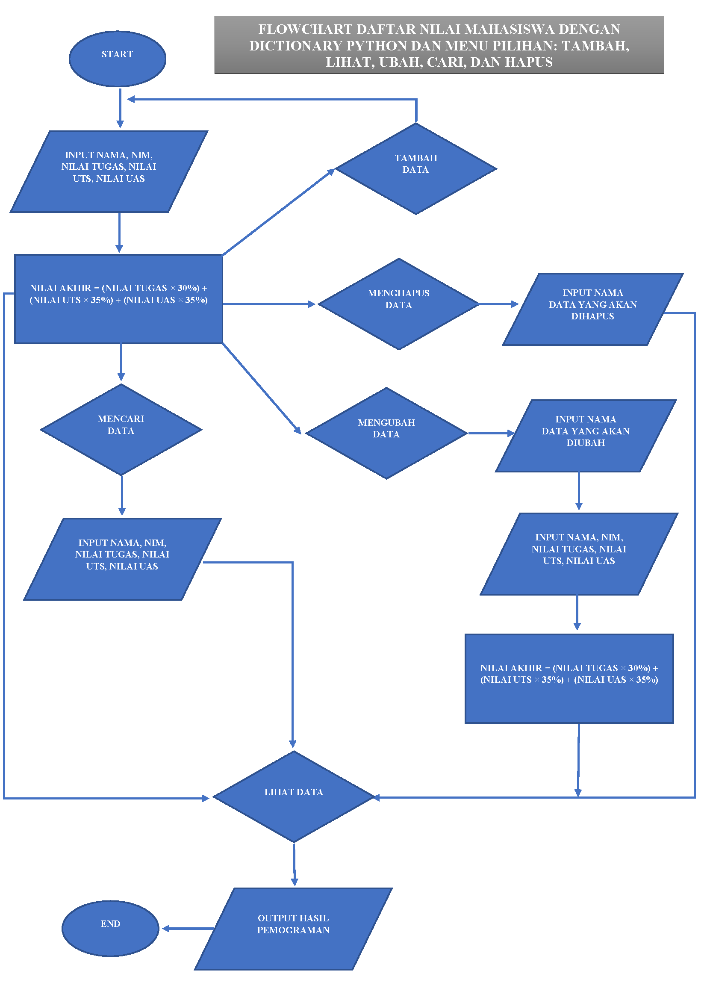

# Lab6
Modul praktikum 6 ini berisikan latihan menggunakan dictionary pada python, dan juga praktikum membuat Program Daftar Nilai Mahasiswa menggunakan dictionary dan juga menampilkan pilihan menu antara lain: Ubah, Tambah, Hapus, Cari, Lihat!

# Latihan 


### Latihan yang pertama adalah membuat daftar keluar masuk mahasiswa dengan menggunakan dictionary pada python
- berikut source code nya:
```python
datakeluarmasukmahasiswa = {"nama":"nim"}
nim = {'Jono':'312110989', 'Arum':'312118986'}

print("      Daftar Mahasiswa    ")
print("="*30)
print("   nama     |       nim   ")
print("="*30)
print("   Jono     |   ",nim['Jono'])
print("   Arum     |   ",nim['Arum'])
print("="*30)

print("Menampilkan Data Arum")
print("="*21)
print("  Arum  | ",nim['Arum'])
print("="*21)

print("Menambah Data Rahmat dan Nim 312110189")
nim['Rahmat']='312110189'
print("="*38)
print("     Rahmat      |      ",nim['Rahmat'])
print("="*38)

print("Mengubah Nim Jono dengan nim baru 312189098")
nim['Jono']='312189098'
print("="*43)
print("        Jono        |       ",nim['Jono'])
print("="*43)

print("Menampilkan semua nama mahasiswa yang masuk")
print("="*44)
print(nim.keys())
print("="*44)

print("     Menampilkan semua nim mahasiswa yang masuk    ")
print("="*52)
print(nim.values())
print("="*52)

print("                       Menampilkan daftar nama dan nim                      ")
print("="*83)
print(nim.items())
print("="*83)

print("        Hapus data mahasaiswa keluar      ")
nim.pop('Arum')
print("="*60)
print(nim.items())
print("="*60)
```

Dengan penjelasan source code sebagai berikut:
- Dibawah ini adalah untuk menampung data dari dictionary

```python
datakeluarmasukmahasiswa = {"nama":"nim"}
nim = {'Jono':'312110989', 'Arum':'312118986'}
```

- Sedangkan code dibawah adalah untuk mengakses atau menampilkan nim yang telah ditampung dalam data dictionary tersebut

```python
print("      Daftar Mahasiswa    ")
print("="*30)
print("   nama     |       nim   ")
print("="*30)
print("   Jono     |   ",nim['Jono'])
print("   Arum     |   ",nim['Arum'])
print("="*30)
```
- berikut hasil programnya:


- Code dibawah ini adalah untuk menampilkan salah satu dari daftar Data yang ada, dibawah yang akan di tampilkan adalah daftar nim Arum
```python
print("Menampilkan Data Arum")
print("="*21)
print("  Arum  | ",nim['Arum'])
print("="*21)
```
- berikut hasil programnya:


- Code dibawah ini untuk menambahkan data dengan nama Riko dan nim 312110189

```python
print("Menambah Data Rahmat dan Nim 312110189")
nim['Rahmat']='312110189'
print("="*38)
print("     Rahmat      |      ",nim['Rahmat'])
print("="*38)

```

- berikut hasil programnya:


- Code dibawah untuk mengubah Nim dengan Nim baru  312189098

```python
print("Mengubah Nim Jono dengan nim baru 312189098")
nim['Jono']='312189098'
print("="*43)
print("        Jono        |       ",nim['Jono'])
print("="*43)
```

- berikut hasil programnya:


- Code dibawah untuk menampilkan semua nama yang ada dalam daftar Mahasiswa yang masuk

```python
print("Menampilkan semua nama mahasiswa yang masuk")
print("="*44)
print(nim.keys())
print("="*44)
```

- berikut hasil programnya:


- Code berikut untuk menampilkan semua nim yang ada dalam daftar mahasiswa

```python
print("     Menampilkan semua nim mahasiswa yang masuk    ")
print("="*52)
print(nim.values())
print("="*52)
```

- berikut hasil programnya:


- Code berikut untuk menampilkan semua daftar mahasiswa beserta nama dan nim

```python
print("                       Menampilkan daftar nama dan nim                      ")
print("="*83)
print(nim.items())
print("="*83)
```

- berikut hasil programnya:


- Code dibawah untuk menghapus data Arum yang tersimpan dalam daftar Masuk Mahasiswa

```python
print("        Hapus data mahasaiswa keluar      ")
nim.pop('Arum')
print("="*60)
print(nim.items())
print("="*60)
```

- berikut hasil programnya:


# Praktikum

### Dibawah ini adalah program sederhana untuk membuat daftar nilai mahasiswa dengan menggunakan dictionary, dan menampilkan pilihan menu tambah, ubah, cari, hapus, dan lihat

- berikut code source nya:

```python
a = {}

while True:
    x = input("(T)ambah, (U)bah, (H)apus, (C)ari, (L)ihat, (K)eluar: ")

    if x.lower() == 't':
        print("Tambah Data")
        nama = input("Nama           : ")
        nim = int(input("NIM            : "))
        uts = int(input("Nilai UTS      : "))
        uas = int(input("Nilai UAS      : "))
        tugas = int(input("Nilai Tugas    : "))
        n_akhir = tugas * 0.30 + uts * 0.35 + uas * 0.35
        a[nama] = nim, uts, uas, tugas, n_akhir

    elif x.lower() == 'u':
        print("Ubah Data")
        nama = input("Masukkan Nama   : ")
        if nama in a.keys():
            nim = int(input("NIM            : "))
            uts = int(input("Nilai UTS      : "))
            uas = int(input("Nilai UAS      : "))
            tugas = int(input("Nilai Tugas    : "))
            n_akhir = tugas*0.30 + uts*0.35 + uas*0.35
            a[nama] = nim, uts, uas, tugas, n_akhir
        else:
            print("Nama{0} Tidak Ditemukan".format(nama))

    elif x.lower() == 'h':
        print("Hapus Data")
        nama = input("Masukkan Nama  : ")
        if nama in a.keys():
            del a[nama]
        else:
            print("Nama {0} Tidak Ditemukan".format(nama))

    elif x.lower() == 'c':
        print("Cari Data")
        nama = input("Masukkan Nama : ")
        if nama in a.keys():
            print("=" * 73)
            print("|                             Daftar Mahasiswa                          |")
            print("=" * 73)
            print("| Nama            |       NIM       |  UTS  |  UAS  |  Tugas  |  Akhir  |")
            print("=" * 73)
            print("| {0:15s} | {1:15d} | {2:5d} | {3:5d} | {4:7d} | {5:7.2f} |"
                  .format(nama, nim, uts, uas, tugas, n_akhir))
            print("=" * 73)
        else:
            print("Nama {0} Tidak Ditemukan".format(nama))

    elif x.lower() == 'l':
        if a.items():
            print("=" * 78)
            print("|                               Daftar Mahasiswa                             |")
            print("=" * 78)
            print("|No. | Nama            |       NIM       |  UTS  |  UAS  |  Tugas  |  Akhir  |")
            print("=" * 78)
            i = 0
            for y in a.items():
                i += 1
                print("| {no:2d} | {0:15s} | {1:15d} | {2:5d} | {3:5d} | {4:7d} | {5:7.2f} |"
                      .format(y[0][:13], y[1][0], y[1][1], y[1][2], y[1][3], y[1][4], no=i))
                print("=" * 78)
        else:
            print("=" * 78)
            print("|                               Daftar Mahasiswa                             |")
            print("=" * 78)
            print("|No. | Nama            |       NIM       |  UTS  |  UAS  |  Tugas  |  Akhir  |")
            print("=" * 78)
            print("|                                TIDAK ADA DATA                              |")
            print("=" * 78)

    elif x.lower() == 'k':
        break

    else:
        print("Pilih Menu Yang Tersedia")

```

- berikut dengan flowchart programnya:



Dengan penjelasan source code sebagai berikut:
- Code dibawah ini untuk membuat dictionary kosong, untuk menampung dictionary dengan menggunakan tuple

```python
a = {}
```

- Code dibawah ini untuk perulangan while, dan juga untuk menginisialkan penambahan menu pilihan Tambah, Ubah, Hapus, Cari, Lihat dan Keluar:

```python
while True:
    x = input("(T)ambah, (U)bah, (H)apus, (C)ari, (L)ihat, (K)eluar: ")
```

- Code dibawah adalah untuk syntax penambahan data, dengan ketentuan jika kita mengetikkan 't' pada keyboard, maka akan melakukan penambahan data dan ditampung kedalam dictionary 'a' yang telah kita buat, dengan nama sebagai keys, dan yang lainnya sebagai values

```python
    if x.lower() == 't':
        print("Tambah Data")
        nama = input("Nama           : ")
        nim = int(input("NIM            : "))
        uts = int(input("Nilai UTS      : "))
        uas = int(input("Nilai UAS      : "))
        tugas = int(input("Nilai Tugas    : "))
        n_akhir = tugas * 0.30 + uts * 0.35 + uas * 0.35
        a[nama] = nim, uts, uas, tugas, n_akhir
```

- Code dibawah adalah untuk syntax mengubah data, dengan ketentuan jika kita mengetikkan 'u' pada keyboard, maka akan melakukan perubahan data yang telah di tampung ke dalam dictionary 'a' yang telah kita buat, tetapi data yang dapat diubah hanya data yang berupa values nya saja

```python
    elif x.lower() == 'u':
        print("Ubah Data")
        nama = input("Masukkan Nama   : ")
        if nama in a.keys():
            nim = int(input("NIM            : "))
            uts = int(input("Nilai UTS      : "))
            uas = int(input("Nilai UAS      : "))
            tugas = int(input("Nilai Tugas    : "))
            n_akhir = tugas*0.30 + uts*0.35 + uas*0.35
            a[nama] = nim, uts, uas, tugas, n_akhir
        else:
            print("Nama{0} Tidak Ditemukan".format(nama))
```

- Code dibawah adalah untuk syntax penghapusan data, dengan ketentuan jika kita mengetikkan 'h' pada keyboard, maka akan melakukan penghapusan data yang telah kita masukkan kedalam dictionary 'a' yang telah kita buat dengan statemen ```del a[nama]```

```python
    elif x.lower() == 'h':
        print("Hapus Data")
        nama = input("Masukkan Nama  : ")
        if nama in a.keys():
            del a[nama]
        else:
            print("Nama {0} Tidak Ditemukan".format(nama))
```

- Code dibawah adalah untuk syntax pencarian data, dengan ketentuan jika kita mengetikkan 'c' pada keyboard, maka akan melakukan pencarian data dengan memasukkan keys dari data yang telah kita masukkan kedalam dictionary 'a' yang telah kita buat

```python
    elif x.lower() == 'c':
        print("Cari Data")
        nama = input("Masukkan Nama : ")
        if nama in a.keys():
            print("=" * 73)
            print("|                             Daftar Mahasiswa                          |")
            print("=" * 73)
            print("| Nama            |       NIM       |  UTS  |  UAS  |  Tugas  |  Akhir  |")
            print("=" * 73)
            print("| {0:15s} | {1:15d} | {2:5d} | {3:5d} | {4:7d} | {5:7.2f} |"
                  .format(nama, nim, uts, uas, tugas, n_akhir))
            print("=" * 73)
        else:
            print("Nama {0} Tidak Ditemukan".format(nama))
```

- Code dibawah adalah untuk syntax melihat data, dengan ketentuan jika kita mengetikkan 'l' pada keyboard, maka akan menampilkan keseluruhan dari data yang telah kita masukkan dan ditampung ke dalam dictionary 'a' yang telah kita buat

```python
    elif x.lower() == 'l':
        if a.items():
            print("=" * 78)
            print("|                               Daftar Mahasiswa                             |")
            print("=" * 78)
            print("|No. | Nama            |       NIM       |  UTS  |  UAS  |  Tugas  |  Akhir  |")
            print("=" * 78)
            i = 0
            for y in a.items():
                i += 1
                print("| {no:2d} | {0:15s} | {1:15d} | {2:5d} | {3:5d} | {4:7d} | {5:7.2f} |"
                      .format(y[0][:13], y[1][0], y[1][1], y[1][2], y[1][3], y[1][4], no=i))
                print("=" * 78)
```

- Code dibawah adalah untuk menampilkan 'TIDAK ADA DATA', jika kita belum pernah memasukkan data kedalam dictionary 'a'

```python
        else:
            print("=" * 78)
            print("|                               Daftar Mahasiswa                             |")
            print("=" * 78)
            print("|No. | Nama            |       NIM       |  UTS  |  UAS  |  Tugas  |  Akhir  |")
            print("=" * 78)
            print("|                                TIDAK ADA DATA                              |")
            print("=" * 78)
```

- sedangkan code dibawah adalah untuk syntax keluar dari program, untuk menghentikan program, dengan ketentuan jika kita mengetikkan 'k' pada keyboard, maka akan keluar dari program tersebut

```python
    elif x.lower() == 'k':
        break
```

- Dan code yang terakhir adalah untuk syntax jika kita mengetikkan pada keyboard selain dari huruf yang telah di definisikan di atas seperti 't', 'u', 'h', 'c', 'l', dan 'k', maka akan menampilkan Pilih Menu Yang Tersedia

```python
    else:
        print("Pilih Menu Yang Tersedia")
```

### Berikut hasil program praktikum, jika programnya di jalankan

- Menambahkan Data dengan syntax 't' dan melihat data dengan syntax 'l'

```python
(T)ambah, (U)bah, (H)apus, (C)ari, (L)ihat, (K)eluar: t
Tambah Data
Nama           : Muhamad Mustagfirin
NIM            : 312110119
Nilai UTS      : 85
Nilai UAS      : 75
Nilai Tugas    : 80
(T)ambah, (U)bah, (H)apus, (C)ari, (L)ihat, (K)eluar: l
====================================================================================
|                               Daftar Mahasiswa                                   |
====================================================================================
|No. | Nama                  |       NIM       |  UTS  |  UAS  |  Tugas  |  Akhir  |
====================================================================================
|  1 | Muhamad Mustagfirin   |       312110119 |    85 |    75 |      80 |   80.00 |
==================================================================================== 
```
```python
(T)ambah, (U)bah, (H)apus, (C)ari, (L)ihat, (K)eluar: t
Tambah Data
Nama           : Rozikin
NIM            : 312119876
Nilai UTS      : 75
Nilai UAS      : 85
Nilai Tugas    : 80
(T)ambah, (U)bah, (H)apus, (C)ari, (L)ihat, (K)eluar: l
====================================================================================
|                               Daftar Mahasiswa                                   |
====================================================================================
|No. | Nama                  |       NIM       |  UTS  |  UAS  |  Tugas  |  Akhir  |
====================================================================================
|  1 | Muhamad Mustagfirin   |       312110119 |    75 |    70 |      85 |   76.25 |
====================================================================================
|  2 | Rozikin               |       312119876 |    75 |    85 |      80 |   80.00 |
==================================================================================== 
```
- Mengubah data dengan syntax 'u', dan melihat data dengan syntax 'l'
```python
(T)ambah, (U)bah, (H)apus, (C)ari, (L)ihat, (K)eluar: u
Ubah Data
Masukkan Nama  : Rozikin
NIM            : 312119876
Nilai UTS      : 80
Nilai UAS      : 90
Nilai Tugas    : 75
(T)ambah, (U)bah, (H)apus, (C)ari, (L)ihat, (K)eluar: l
====================================================================================
|                               Daftar Mahasiswa                                   |
====================================================================================
|No. | Nama                  |       NIM       |  UTS  |  UAS  |  Tugas  |  Akhir  |
==============================================================================
|  1 | Muhamad Mustagfirin   |       312110119 |    75 |    70 |      85 |   76.25 |
==============================================================================
|  2 | Rozikin               |       312119876 |    80 |    90 |      75 |   82.00 |
==============================================================================
```
- Mencari data dengan syntax 'c', dan melihat data dengan syntax 'l'
```python
(T)ambah, (U)bah, (H)apus, (C)ari, (L)ihat, (K)eluar: c
Cari Data
Masukkan Nama : Muhamad Mustagfirin
=======================================================================
|                             Daftar Mahasiswa                        |
=======================================================================
| Nama                |    NIM    |  UTS  |  UAS  |  Tugas  |  Akhir  |
=======================================================================
| Muhamad Mustagfirin | 312119876 |  80   |  90   |   75    |  82.00  |
=======================================================================
```
- Menghapus data dengan syntax 'h' dan melihat data dengan syntax 'l'
```python
(T)ambah, (U)bah, (H)apus, (C)ari, (L)ihat, (K)eluar: h
Hapus Data
Masukkan Nama  : Rozikin
(T)ambah, (U)bah, (H)apus, (C)ari, (L)ihat, (K)eluar: l
==============================================================================
|                               Daftar Mahasiswa                             |
==============================================================================
|No. | Nama            |       NIM       |  UTS  |  UAS  |  Tugas  |  Akhir  |
==============================================================================
|  1 | Muhamad Mustagfirin   |       312110119 |    75 |    70 |      85 |   76.25 |
==============================================================================
```
- Keluar dari program dengan syntax 'k'
```python
(T)ambah, (U)bah, (H)apus, (C)ari, (L)ihat, (K)eluar: k

```

#### Sekian praktikum modul 6 dengan penggunaan dictionary pada python ini saya buat. Terima Kasih
